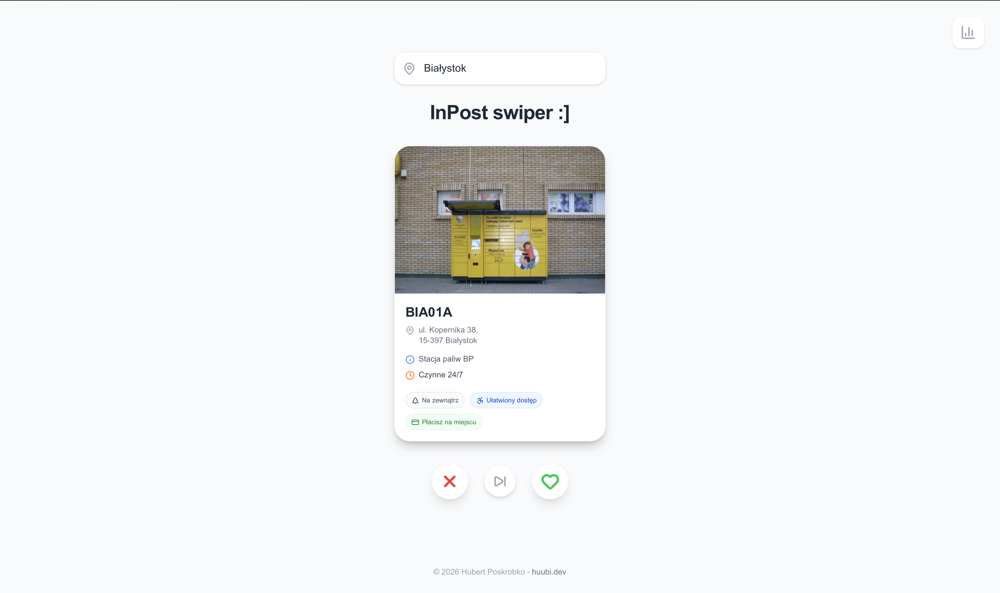
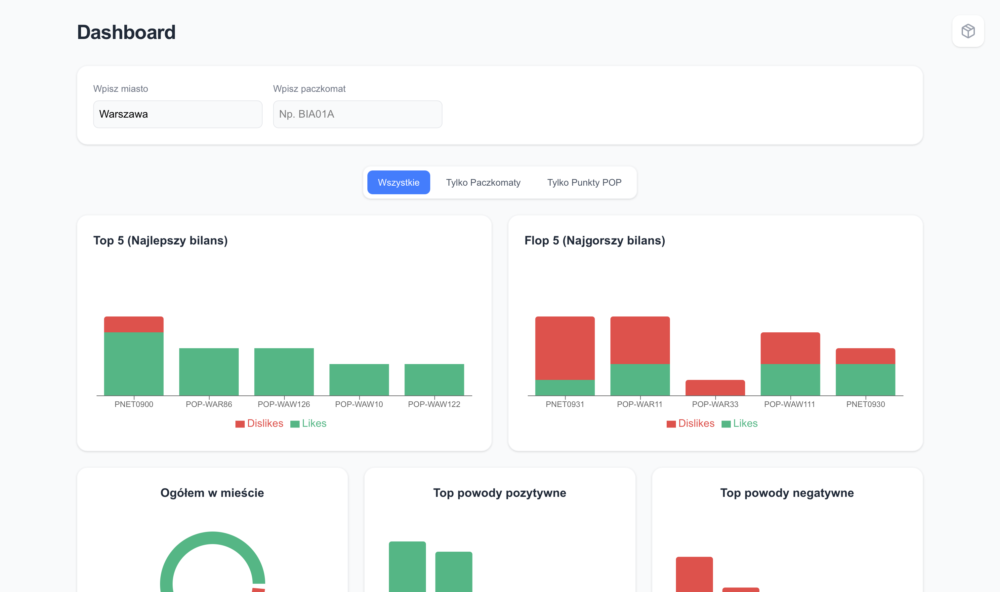

# Parcel locker swiper

## Author

- **Name:** Hubert Poskrobko
- **Email:** hubertposs@wp.pl

## Overview

A web app that connects interactive browsing of InPost parcel lockers/pickup points in a user-specified location with an analytics dashboard. The project solves the problem of boring feedback forms by introducing an engaging swiping UX known from dating apps, delivering vital statistics to correctly maintain delivery points.

## Demo & Description

The project features a main interface for interacting with parcel lockers and an analytics dashboard that presents statistics collected in the database. The application fetches data points from a dedicated InPost API.

I chose a component-based architecture, separating elements responsible for swipe gestures, the feedback form, controls, as well as local and global statistics. Also, I made a reusable card component for displaying locker information.

**Online demo:**

- [Main Application](https://parcel-locker-swiper.hubertposs.workers.dev)
- [Analytics Dashboard](https://parcel-locker-swiper.hubertposs.workers.dev/dashboard)

**Some screenshots:**




## Technologies

- **Next.js:** Main frontend framework, efficient rendering and routing.
- **TypeScript:** Typing safety, catching issues during code compilation.
- **Tailwind CSS:** Rapid modern styling.
- **Framer Motion:** Interactive swipe gestures and animations.
- **Recharts:** Data visualisation charts.
- **Lucide React:** UI icon set.
- **Supabase:** SaaS lightweight backend and database for storing user feedback.
- **CloudFlare:** Demo deployment.

## How to run

### Prerequisites

- Node.js (ver. 18 or higher)
- Package manager (npm, yarn, pnpm, bun)
- Supabase account and API keys

From Supabase you're gonna need:

- NEXT_PUBLIC_SUPABASE_URL
- NEXT_PUBLIC_SUPABASE_ANON_KEY

### Build & run

```bash
# Clone the repo
git clone https://github.com/dckyx/Parcel-locker-swiper
cd Parcel-locker-swiper

# Install dependencies
npm install

# Set up environment variables
touch .env.local
echo 'NEXT_PUBLIC_SUPABASE_URL=<your_supabase_url>' >> .env.local
echo 'NEXT_PUBLIC_SUPABASE_ANON_KEY=<your_supabase_anon_key>' >> .env.local

# Start the development server
npm run dev
```

## What I would do with more time

- **Token-based verification** - checking if a user has already voted on a specific locker to prevent duplicate feedback
- **Geolocation support** - fetching parcel lockers nearby by default
- **Improved location search** - city suggestions
- **Expand main page features** - more functions, more locker details, etc.

## AI usage

I used AI tools like Gemini and GitHub Copilot to help me build this project more efficiently.

- **Planning and Debugging:** I used Gemini to plan the project structure and analyze error logs.
- **Development:** In my IDE, I used GitHub Copilot and Gemini Code Assist. These tools helped me with:
  - Writing Tailwind to match both mobile and web browser styles
  - Building parts of the React components.
  - Creating code documentation and comments.
  - Developing the logic for charts.

**Verification:** I reviewed and tested all AI-generated code. I adapted the outputs to make sure they follow the project's architecture and work correctly with the API.

## Anything else?

I just wanted to make something cool instead of another boring pinned map :]
